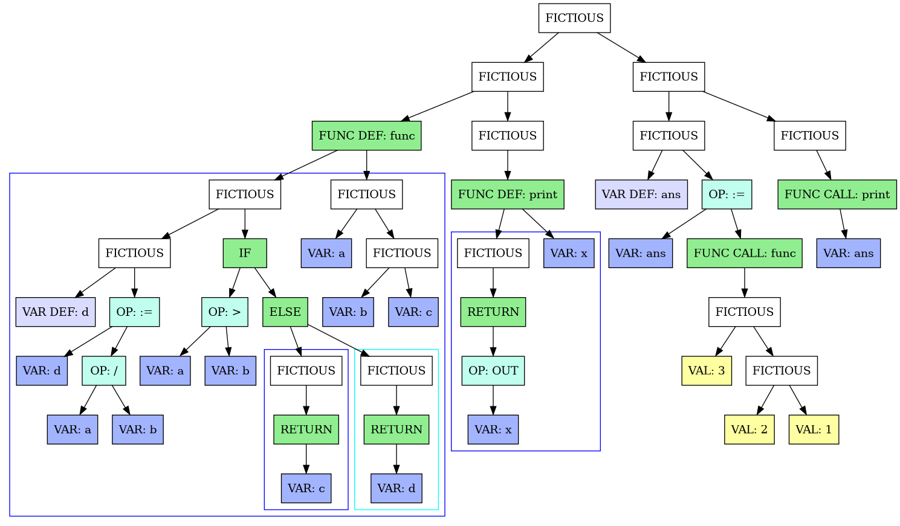

## ReverseLang native compiler for x64 architecture

## Description

A compiler is a program that translates text written in a programming language into a binary executable file.
In a particular case - from ReverseLang into an executable ELF file for amd64 architecture. The syntax of ReverseLang can be found in the 
[quick reference section](#syntax-reverseLang).

## Usage
### Build the compiler

To build the compiler, run the commands:
```bash
$ git clone https://github.com/Radamoviches/x64_compiler # Clone the repository
$ cd x64_compiler && make all                         # Build all necessary binaries
```

Now to build ReverseLang it is enough to use the `compile.sh` script, passing it two arguments - a Reverselang source code file and a path where to save the compiled executable.

For example, to compile and run a program to solve a quadratic equation available in `examples/`:
```bash 
    $ ./compile.sh examples/quad.edoc /tmp/quad.bin
    $ /tmp/quad.bin  
        INPUT: 1     # Решаем x^2-4x+3 = 0
        INPUT: -4
        INPUT: 3
        OUTPUT: 2.00 # 2 roots
        OUTPUT: 1.00 # x = 1
        OUTPUT: 3.00 # x = 3
```

### ReverseLang Syntax

1. All variables have the same type - signed 64-bit numbers.
2. All functions necessarily have a return value.
3. The standard language library contains 3 functions: `input / output / sqrt`.
4. The following mathematical operations can be performed on variables: `+, -, /, *`.
5. Logical comparison operations are available: `>, >=, <, <=`, as well as logical AND/OR (`&& and |||`) and negation (`!``).
6. The language has support for functions, while loops, and if-else blocks.


<details>
  <summary>Syntax </summary>

```
Program        ::= PROG_BEG (SubProgram | Func)* PROG_END
Func           ::= L_BRACKET (NAME (SEP NAME)) R_BRACKET NAME FN FUNC_OPEN_BLOCK Subprogram FUNC_CLOSE_BLOCK
SubProgram     ::= (FlowBlock)+
FlowBlock      ::= IfBlock | WhileBlock | OPEN_BLOCK Body CLOSE_BLOCK | Body
WhileBlock     ::= L_BRACKET Expression R_BRACKET WHILE OPEN_BLOCK Body CLOSE_BLOCK
IfBlock        ::= L_BRACKET Expression R_BRACKET IF OPEN_BLOCK Body CLOSE_BLOCK (ELSE OPEN_BLOCK Body CLOSE_BLOCK)
Body           ::= (Line)+
Line           ::= BREAK Expression RETURN | BREAK Expression (= NAME (LET))
Expression     ::= OrOperand (|| OrOperand)+
OrOperand      ::= AndOperand (&& AndOperand)+
AndOperand     ::= CompOperand (<=> CompOperand)
CompOperand    ::= AddOperand  ([+-] AddOperand)*
AddOperand     ::= MulOperand  ([/ *] MulOperand )*
MulOperand     ::= GeneralOperand (NOT)
GeneralOperand ::= Quant | L_BRACKET Expression R_BRACKET
Quant          ::= VAR | VAL | INPUT | BuiltInFunc | L_BRACKET (Expression (SEM Expression)) R_BRACKET NAME
BuiltInFunc    ::= L_BRACKET Expression R_BRACKET (PRINT|SQRT|SIN)
```
</details>

The ReverseLang syntax is C-like with one feature: each line should be read from right to left. So, for example,
the following C code
```c
int func (int a, int b, int c) {
    int d = a / b;
    
    if (a > b) {
        return c;
    } else {
        return d;
    }   
}
```
in ReverseLang will take the form
```rust
(c, b, a) func fn
[
    ; b / a = d let
    (b > a) if
    {
        ; c return
    } else {
        ; d return
    }
]
```

The full version of this example, as well as the others, can be found in the `examples/` directory

### Principle of operation

### Compiler architecture

The compiler is organized into three key components that process source code step by step and use an abstract syntax tree (_abstract syntax tree_) as an internal representation. 
syntax tree (_abstract syntax tree_, AST). In the syntax tree, the internal nodes are mapped to programming language operators, and the leaves are mapped to the corresponding operands.
An example of such a tree is given at the end of this section. 

**Frontend**
1. lexical analysis breaks source code into logical quanta (tokens) - numbers, keywords, variable and function names.
2. Syntactic analysis assembles syntactic constructs such as functions and loops from tokens using a recursive descent algorithm. 
3. The recursive descent process builds an abstract syntax tree, which is the final output of the frontend.

**Intermediate Optimizer (middleend)**

The optimizer takes AST as input and tries to simplify it without breaking the program logic. At the moment, only calculation of constant expressions is used among the optimizations: having detected 
constant expressions: having detected a construct from mathematical or logical operations on numbers, the optimizer calculates it and replaces it with the result. 

**Backend**. 

The backend takes an optimized AST tree as input and, by traversing it in postorder, generates machine code for each vertex.
Thus, when the code of any operation is executed, the code for calculating its operands will already be executed.

#### Rationale of the compiler architecture
This architecture allows reusing common chunks when adapting the compiler for other languages or other architectures. 
other architectures. So, for example, compilers of one language under `x64` and `arm` can use common
frontend and optimizer, while compilers of two different languages for the same architecture may overuse the optimizer and backend.

In this case, since the frontends of the languages [ICPC](https://github.com/diht404/language) and [kaban54's lang](https://github.com/kaban54/language) were developed in a joint project with ReverseLang and
have a compatible AST format, they can be compiled using the ReverseLang backend.

This architecture is not something new and is used in the `GCC` compiler family as well as in `llvm` based compilers, but they use a linear representation instead of AST as an internal representation. 
as an internal representation instead of AST.

**A sample AST**

Let's build an AST for the example from the syntax help:

<details>
  <summary><b>Полный код примера</b></summary>

```rust
~sya~

(x) print fn
[
; (x) __builtin_print__ return
]

(c, b, a) func fn
[
    ; b / a = d let
    (b > a) if
    {
        ; c return
    } else {
        ; d return
    }
]

; (1, 2, 3) func = ans let

; (ans) print

~nya~
```
</details>



*AST visualization for the syntax help example*

### The backend structure

The backend itself also has a modular structure. The process of compiling an AST into machine code is broken down into three steps: 
1. the AST is compiled into a linear intermediate representation (Backend IR) - an array of structures that are assembly code
for the abstract stack processor (more details later in the Backend IR section).
2. Once the IR is obtained, you can start performing optimization passes, such as removing consecutive `push / pop` (_backend optimizations_). However, no optimizations are applied in the backend at this point.
3. This IR is then translated into instructions for the specific processor architecture.

In this case, since a two-pass compilation scheme (_multi-pass compiler_) is used to resolve label addresses, steps 1 and 3 are executed twice.

#### Rationale of the backend architecture
The backend is built on the same architectural principles as the compiler as a whole - partitioning stages for their reuse.
Backend IR allows AST translation to be combined into a set of elementary actions for processor architectures of similar type or for 
different output formats. Thus, in addition to compiling to a binary file, this compiler is able to work in JIT mode
with minimal code duplication.

#### Backend IR

This compiler uses a linked list of structures as IR
```c++
    struct instruction_t {
        instruction_type_t type;            // Тип инструкции — push / add / call / etc
        struct {                            // Какие аргументы требуются инструкции
            unsigned char need_imm_arg: 1;  // - Константа
            unsigned char need_reg_arg: 1;  // - Регистр
            unsigned char need_mem_arg: 1;  // - Извлекается ли аргумент из памяти
        };

        unsigned char reg_num;              // Номер регистра-аргумента (если используется)
        uint64_t imm_arg;                   // Константный аргумент (если используется)

        size_t index;                       // Номер инструкции в IR
        instruction_t *next;                // Указатель на следующую структуру
    };
```

In this case, IR is designed for an abstract stack processor, and therefore has the following instructions:

| Command | Action |
|--------------------|------------------------------------------------------------------------------------------------------------------------------------------------------|
| `push imm/reg/mem` | Put a constant, a value from a register or from RAM on the stack at `reg + imm` where one of the operands (`reg` or `imm`) is optional.              |
| `pop reg/mem`      | Extract a value from the stack and put it into a register or RAM `add/sub/mul/dem`                                                                   |
| `add/sub/mul/div`  | Arithmetic operations with the top two elements on the stack (the top element of the stack is the right operand                                      |
| `qrt / sin / cos`  | Arithmetic operations with one element on the stack                                                                                                  |
| `call/jmp/j?? imm` | Jump to an address (structure number in IR). `j??` denotes conditional jumps (`ja, jae, jb, jbe, je, jne`)                                           |
| `inp / out`        | Input / output of the top element of the stack                                                                                                       |
| `ret`              | The return command from a function, the inverse of call                                                                                              |
| `halt`             | Termination of the program, analogous to the `abort()` function in C                                                                                 |

All instructions absorb their operands, if any, and place it on top of the stack if there is a return value. 

### ELF file structure


As a result of compilation, an executable ELF file containing the translated code and standard library code is created.

To do this, the following information is written to the executable file:

1. **The ELF file header** contains general information about the binary: the required processor architecture, the input address, the number and location of the
segment headers. 

```c++
const Elf64_Ehdr ELF_HEADER = {
    .e_ident = {ELFMAG0, ELFMAG1, ELFMAG2, ELFMAG3, // Magic signature
                ELFCLASS64,                         // 64-bit system
                ELFDATA2LSB,                        // LittleEndian / BigEndian
                EV_CURRENT,                         // Version = Current
                ELFOSABI_NONE,                      // Non specified system
                0
                },
                
    .e_type    = ET_EXEC,                      // File type = Executable
    .e_machine = EM_X86_64,                    // Arch = amd64
    .e_version = EV_CURRENT,                   // Version = Current
    
    .e_entry   = 0x402000,                     // Fixed entry addr
    
    .e_phoff    = sizeof(Elf64_Ehdr),          // Offset of program header table. We took size of elf header
    .e_shoff    = 0,                           // Offset of segment header table. Not used => 0
    
    .e_flags    = 0,                           // Extra flags: no flags
    .e_ehsize   = sizeof(Elf64_Ehdr),	       // Size of this header.
    
    .e_phentsize = sizeof(Elf64_Phdr),         // Size of Program header table entry.
    .e_phnum     = NUM_PHEADERS,               // Number of pheader entries. (system + stdlib + code + ram)
    
    .e_shentsize = sizeof(Elf64_Shdr),         // Size of Segment header entry.
    .e_shnum     = 0,                          // Number of segments in programm.
    .e_shstrndx  = 0,                          // Index of string table. (Explained in further parts).
};

```

2. **Segment headers** contain detailed information about each program segment: access rights, location and size in the executable file, and the address where it should be loaded.
This compiler uses only 4 segments:

* **Service Segment**
```c++
Elf64_Phdr SYSTEM_PHEADER = {
        .p_type   = PT_LOAD,
        .p_flags  = PF_R       , /* read */
        .p_offset = 0          , /* (bytes into file) */
        .p_vaddr  = 0x400000   , /* (virtual addr at runtime) */
        .p_paddr  = 0x400000   , /* (physical addr at runtime) */
        .p_filesz = sizeof(Elf64_Ehdr) + NUM_PHEADERS * sizeof(Elf64_Phdr), /* (bytes in file) */
        .p_memsz  = sizeof(Elf64_Ehdr) + NUM_PHEADERS * sizeof(Elf64_Phdr), /* (bytes in mem at runtime) */
        .p_align  = 4096       , /* (min mem alignment in bytes) */
};
```

This header is present in all ELF executable files and loads all service information of the executable at `0x400000` with read-only permissions.

* **Standard Library Segment**
```c++
Elf64_Phdr STDLIB_PHEADER = {
        .p_type   = PT_LOAD,
        .p_flags  = PF_R | PF_X,           /* Read & Execute */
        .p_offset = 4096,                  /* (bytes into file) */
        .p_vaddr  = 0x401000,              /* (virtual addr at runtime) */
        .p_paddr  = 0x401000,              /* (physical addr at runtime) */
        .p_filesz = x64::STDLIB_SIZE,      /* (bytes in file) */
        .p_memsz  = x64::STDLIB_SIZE,      /* (bytes in mem at runtime) */
        .p_align  = 4096,                  /* (min mem alignment in bytes) */
};
```

For ease of executable file generation, the standard library is loaded into its own segment at address ` 0x403000`
with execution rights. Since the code from the executable file is not actually copied but only mapped into virtual memory, all segments must
start at addresses that are multiples of the page size - 4096 bytes. Therefore, the standard library is forced to be written into the binary starting at the 4096 byte address (`.p.p.').
4096 bytes (`.p_offset`) rather than immediately after the segment headers.

* **Generated Code Segment**

The generated code segment differs from the standard library only in the loading address, `0x402000`, which is the same as the input address from the ELF header. 
with the input address from the ELF header (field `.e_entry`). Thus, after the ELF file is loaded into memory, this particular segment starts to be executed.
this particular segment is executed.

* **Memory Segment**

The main difference between the RAM segment and the others is that it does not take up disk space. Instead, when an ELF file is loaded
the operating system itself will allocate a memory area of a given size and fill it with zeros. This is expressed in the null field
`.p_filesz`, which is responsible for the size of the segment in the file, and the non-zero `.p_memsz`, which is responsible for the size after loading.

```c++
const Elf64_Phdr BSS_PHEADER = {
        .p_type   = PT_LOAD,
        .p_flags  = PF_R | PF_W,
        .p_offset = 0,              /* (bytes into file) */
        .p_vaddr  = 0x405000,       /* (virtual addr at runtime) */
        .p_paddr  = 0x405000,       /* (physical addr at runtime) */
        .p_filesz = 0,              /* (bytes in file) */
        .p_memsz  = x64::RAMSIZE,   /* (bytes in mem at runtime) */
        .p_align  = 4096,           /* (min mem alignment in bytes) */
};
```

### Standard library

The following functions are implemented in the ReverseLang standard library - I/O, square root extraction, and program termination (for the halt instruction).
These functions are written in assembler with direct use of system calls to avoid the necessity of
linking with glibc and subsequent multiple complication of ELF file structure. The source code of stdlib is located in
`src/asm_stdlib/stdlib.nasm`.

The standard library is assembled into an object file for linking with the compiler (where it is used in JIT mode), as well as into an executable file for ease of further processing.
For clarity, when you run the standard library as an executable, it will display a help message and terminate.

The standard library is built automatically with make, but it can also be built manually:
```bash
    $ cd src/asm_strlib
    $ nasm -f elf64 stdlib.asm                        # Сборка объектного файла
    $ ld -e stub_entry -s -S stdlib.o -o stdlib.out # Сборка бинарного файла
```

The executable is used when adding standard library code to the generated binary. The compiler loads `stdlib.out`, analyzes its ELF header, and copies the code it contains
code contained therein into the output file. However, the compiler also needs to know the library functions' offsets to access them, information that cannot be obtained simply by analyzing segment headers.
Since there are few functions in the standard library and they almost never change, it was decided to write function offsets as constants. 

You can find them out using the `readelf` utility by analyzing the standard library object file with its help:
```bash
    $ readelf -a stdlib.o
        ... 48 lines missing ...

The symbol table ".symtab" contains 16 elements:
   Num:     Value        Size Type  Connection Vis    Name Index
     0: 0000000000000000     0 NOTYPE  LOCAL  DEFAULT  UND 
     1: 0000000000000000     0 FILE    LOCAL  DEFAULT  ABS stdlib.nasm
     2: 0000000000000000     0 SECTION LOCAL  DEFAULT    1 .text
     3: 000000000000004f     0 NOTYPE  LOCAL  DEFAULT    1 input_asm.L6
     4: 0000000000000059     0 NOTYPE  LOCAL  DEFAULT    1 input_asm.L4
     5: 0000000000000081     0 NOTYPE  LOCAL  DEFAULT    1 input_asm.L19
     6: 0000000000000092     0 NOTYPE  LOCAL  DEFAULT    1 input_asm.L18
     7: 00000000000000a6     0 NOTYPE  LOCAL  DEFAULT    1 input_asm.L16
     8: 0000000000000175     0 NOTYPE  LOCAL  DEFAULT    1 output_asm.L28
     9: 00000000000001a6     0 NOTYPE  LOCAL  DEFAULT    1 output_asm.L27
    10: 00000000000001bf     0 NOTYPE  LOCAL  DEFAULT    1 output_asm.L29
    11: 00000000000001e3     0 NOTYPE  LOCAL  DEFAULT    1 output_asm.L30
    12: 0000000000000000     0 NOTYPE  GLOBAL DEFAULT    1 input_asm
    13: 00000000000000ad     0 NOTYPE  GLOBAL DEFAULT    1 output_asm
    14: 00000000000001ef     0 NOTYPE  GLOBAL DEFAULT    1 exit_asm
    15: 00000000000001fb     0 NOTYPE  GLOBAL DEFAULT    1 sqrt_asm
```
 
As you can see from the output of this program, the `input_asm` code is at the very beginning, `output_asm` starts at offset `0xAD` and so on.

#### Running Time Comparison

Since a backend for the stack processor emulator was written in the previous semester (repositories [backend](https://github.com/foxidokun/ReverseLang) and [emulator](https://github.com/foxidokun/cpu)), we can compare the performance of native x64 code with running on the stack processor emulator.
For comparison let's measure the running time of two programs: solving the quadratic equation $2x² + 2x - 12 = 0$ and calculating the 15th Fibonacci number, the code of which is located in `examples/` (sources: [equation](https://github.com/foxidokun/x64_compiler/blob/master/examples/quad_bench.edoc), [Fibonacci](https://github.com/foxidokun/x64_compiler/blob/master/examples/fib_bench.edoc)). 

**Methodology of measurements**

In order to increase the time spent on program execution and to increase the accuracy of measurements in each program the corresponding algorithm is run 10000 times.
At the same time, five additional runs are performed for each program, the results of which are subsequently averaged and the error is calculated.

<details>
  <summary>Information about the test bench</summary>

```
    OS: Arch Linux (22.05.2023)
    Kernel: linux-6.3.1
    CPU: Ryzen 7 4800H
    CPU Governor: perfomance (max frequency) 
    
    No programs, except for the program under test and service programs, are running during measurements, and the program under test is given maximum priority (nice level is set to -20).
```

</details>


Measurement results:

| Program              | x64             | stack cpu        | Acceleration    |
|----------------------|-----------------|------------------|-----------------|
| Quadratic equation   | `9.3  ± 0.2 ms` | `50.6  ± 0.5 ms` | `5.44 ± 0.03`   |
| Fibonacci number     | `68.2 ± 0.7 ms` | `403.1 ± 0.9 ms` | `5.910 ± 0.012` |


As we can see from the table, using native architecture instead of emulator gives a significant performance gain (5.5 times).
